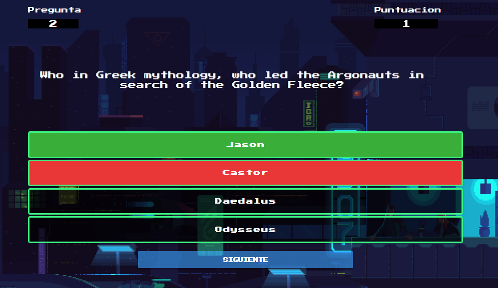
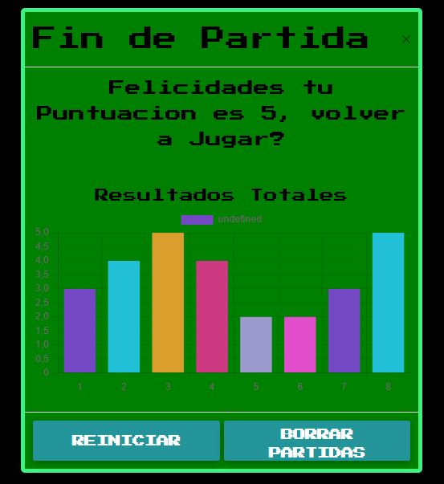

# QUIZ RETRO-8-BIT 

## Description
In this exercise we have worked in pairs trying to dominate the Github.
Other challenges to overcome have been to implement APIs for the data and develop all the knowledge learned so far in class.

### Authors
[David Ubeda](https://github.com/Dubesor22)  & [Imanol Fuertes](https://github.com/Imi21)

### Technologies used
* HTML5 (only one file)
* CSS
* [MDB for Bootstrap 5](https://mdbootstrap.com/)
* JavaScript (SPA)
* ECMAScript6

### Challenge
Code a funcional quiz:
* With 10 questions
* Each question with 4 possible answers
* As a Single Page Application
* Fetching questions from an API
* Storing results in localStorage

## Screenshots

### GIF
A GIF as background for the game

### Question
Answer buttons with noted error and correct answer

### Main Menu
Main menu to start game

### Graphic results

## TODO lists

* 10 questions Exercise 
* Modal or insert at beggining with a Start Button.
* Finish Screen with a chart with some stadistics.

### HTML, CSS
- [x] Structure of html minimal elements
- [x] Add navBar
- [x] Structure of html main containers
- [x] Add BS classes to elements
- [x] Beautify results
- [x] Spinner
- [x] Stats chart in home

### JS
- [x] Async Await from API
- [x] Quiz functionality (questions, answers, next/back navigation)
- [x] Count right/wrong points
- [x] Show result points
- [x] Show result sentence (according to points)
- [x] Store points in localStorage
- [x] Retrieve points from localStorage
- [x] Show points in stats block
- [x] Progress bar
- [x] Toast
- [x] Put data in chart
